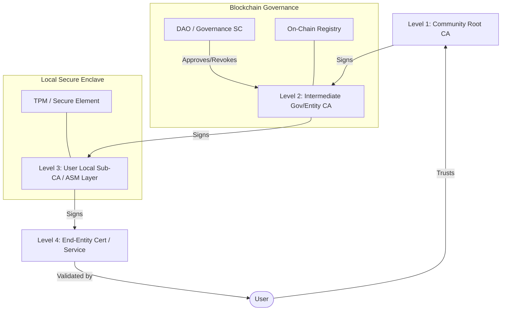

# Technical Architecture: Certia (yuxiCA)

## System Components

## Hierarchical Trust Model (4-Level Sovereign Design)

## 1. Trust Levels
1. **Root CA (Level 1):** The "International Treaty". Stored offline, its hash is anchored on-chain. It only signs high-level Intermediate CAs.
2. **Intermediate CAs (Level 2):** Authorized entities (Governments, Organizations) that receive power to manage specific TLDs (e.g., `.mesh`, `.comunidad`).
3. **Local Sub-CA / ASM Layer (Level 3):** Each project or user node generates its own "Mini-CA". This CA is signed by Level 2 and is restricted by **Name Constraints** to personal domains (e.g., `*.mi-laptop.local`).
4. **End-Entity Certificates (Level 4):** Final certificates for Docker services, web apps, or IoT nodes, signed automatically by the Local Sub-CA.

## 2. Registry Smart Contract (Solidity)
The decentralised source of truth.
- **Map:** `mapping(bytes32 => bool) public isRevoked;`
- **Map:** `mapping(bytes32 => uint256) public issuanceTimestamp;`
- **Logic:** Only authorized issuers (governed by DAO) can anchor hashes.

## 3. dDV (Decentralized Domain Validation)
- Instead of a single server checking DNS TXT records, a network of nodes performs the check.
- Prevents "Shadow CAs" from issuing certificates for domains they don't control.

## 5. Security: Granular Trust via ASM Layer
To mitigate the risk of endpoint compromise, RCS implements a **Layered Abstraction of Security (ASM)**.

### Isolation and Impact Minimization
If an attacker infects a user's machine and steals the Local Sub-CA (Level 3) private key:
- **Limited Blast Radius:** The attacker can only issue certificates for domains explicitly permitted in the Sub-CA's **Name Constraints** (e.g., `*.mi-laptop.local`).
- **Global Spoofing Prevention:** Browsers and clients will reject any certificate for global sites (like `google.com`) because the Sub-CA lack the cryptographic permission to sign them.
- **Surgical Revocation:** The community can revoke a specific Level 3 CA on the blockchain without affecting any other node in the network.

### Automated Lifecycle
The ASM Layer acts as a background agent that:
1. Protects the Level 3 private key using hardware-backed security (TPM/Secure Enclaves).
2. Automatically detects new local services and signs the Level 4 leaf certificates on-demand.
